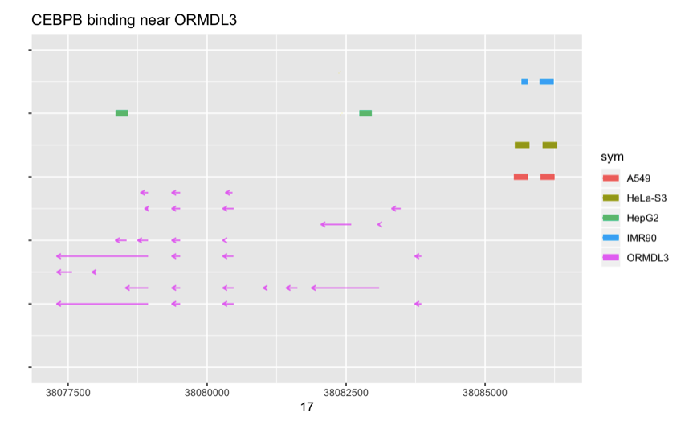

# gggmvis

gene model visualization with ggplot2 idiom

We want to be able to use plotly with a figure like

so we include in this package some facilities for creating
it with ggplot2, ensembldb, and AnnotationHub

